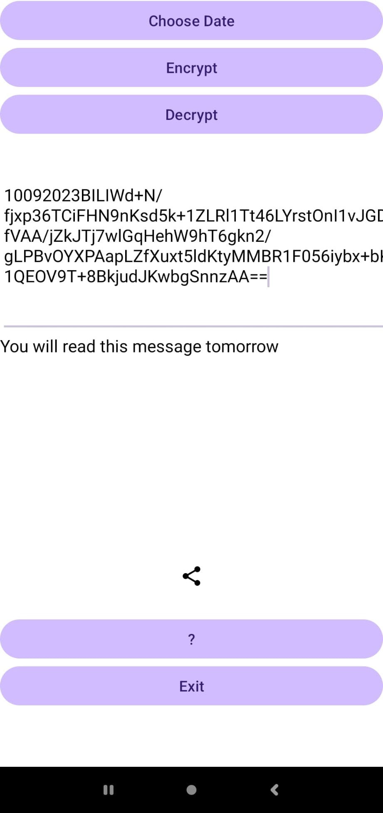

# Timelock.zone.AndroidExample
This repo contains an example of an Android App that can use the [timelock.zone](https://www.timelock.zone) service to encrypt messages to the future and decrypt them. Timelock.zone is a public service built on [drand](https://drand.love) that publishes public keys for future timeframes whose corresponding secret keys will be released at the correpsonding time.
See also [tlcs-c](https://github.com/aragonzkresearch/tlcs-c/), [timelock.fs](https://github.com/vincenzoiovino/timelock.fs) and [TLCS Usage](https://github.com/aragonzkresearch/tlcs-c/blob/main/examples/howtoencrypt.md).

## Dependencies
Add as dependencies ``spongycastle 1.54.0.0``, ``json-simple-1.1.jar`` and [``timelock.zone.jar``](https://github.com/vincenzoiovino/TimelockJavaAPI/tree/main). 

You can download an `apk` from [here](https://github.com/vincenzoiovino/Timelock.zone.AndroidExample/blob/master/timelock.zone.apk). You may need to enable installation of apps from [untrusted sources](https://www.wikihow.com/Allow-Apps-from-Unknown-Sources-on-Android).
## Screenshots

 

 

 

 

